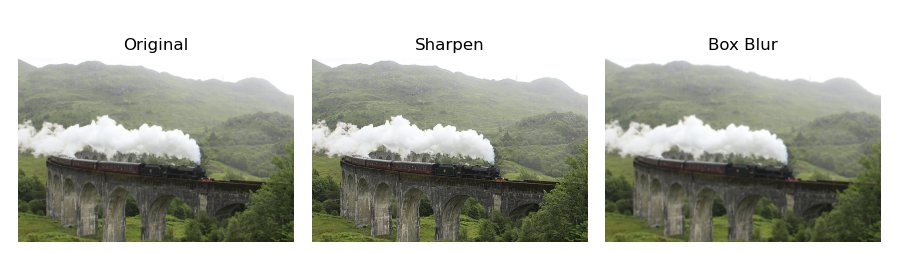
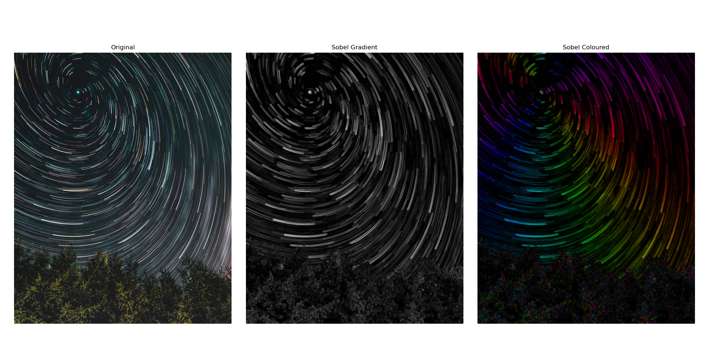
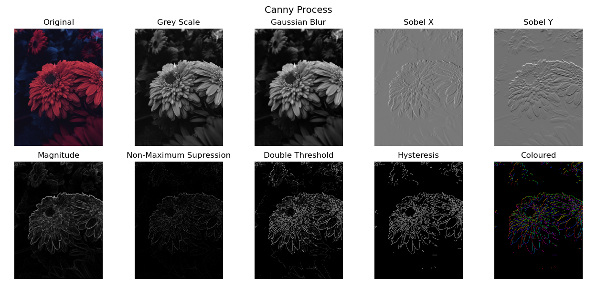

# Image Convolutions
We implement a number of image processing techniques in Python, such as sharpening and blurring by convoluting images with particular kernels. We also apply the multi stage Canny edge detector algorithm to obtain a representation of the edges in an image.

